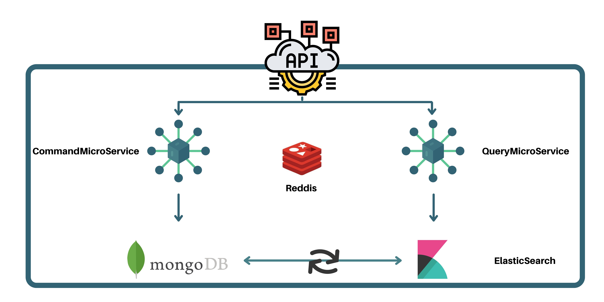

# CQRS Project Scaffolded sandbox
## Architecutre

## Summary
What is CQRS?
CQRS stands for Command and Query Responsibility Segregation, a pattern that separates read and update operations for a data store. 
Implementing CQRS in your application can maximize its performance, scalability, and security. The flexibility created by migrating to CQRS allows a system to better evolve over time and prevents update commands from causing merge conflicts at the domain level.
## The project
An implementation of the CQRS microservices using NestJS.
The cluster is composed of 2 Microservices each holding the responsibilities of reading and writing from/into elasticsearch/mongodb.
Another Synchronisation microservice that sits between mongo and ES to make sure the contents written in mongo are coherent with the content in elasticsearch.
An API gateway for the end user to make calls to.
All of the environment is run on a docker-compose stack.
## TODO
Work on exceptions' returns to the API gateway when they occur in the microservices